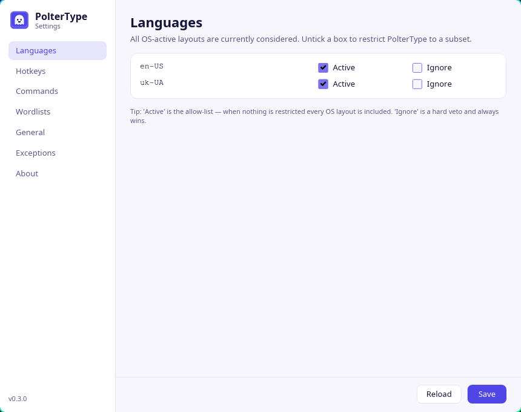

# PolterType

Cross-platform automatic keyboard layout switcher.
Lives in the system tray. Detects when you start typing in the wrong
layout, switches it, and retypes the last word — like a friendly
poltergeist that haunts your keyboard.


*Live capture, unedited timing: `ñ` sits on the US `;` key, so Spanish
typed on an English layout comes out as `ma;ana` — PolterType fixes the
word the moment it ends and switches the layout with it, so `por la
tarde` lands correctly as typed.*

> **Status:** v0.11.0 — out of beta since v0.1.0. Works end-to-end on
> Windows and on Linux (both Wayland and X11); the spelling-
> suggestions tooltip renders on Hyprland, Sway, KDE Plasma and X11
> (GNOME Wayland gets it through XWayland) — **and on Windows since
> 0.11.0**, where it appears above the focused window rather than at
> the caret. On Linux/Wayland a
> correction holds your keystrokes back while it types and replays
> them behind itself, so carrying straight on with the next word no
> longer scrambles the result — except behind an input remapper such
> as keyd, where PolterType stands down and falls back to detecting
> and repairing instead
> ([docs/PERMISSIONS.md](docs/PERMISSIONS.md)). The same hold-back
> exists on Windows and stays **off by default**
> (`POLTERTYPE_HOLD_KEYS=1`) — 0.11.0 is the first release where it has
> run on real hardware, and what that showed is that it works and
> costs a noticeable delay after every correction, which is not a
> trade worth making for everyone
> ([#7](https://github.com/Just-Code-NET/PolterType/issues/7)).
> **macOS: read this
> before updating.** 0.6.2 was validated on real hardware (macOS 15,
> Intel), but 0.7.0 changed the macOS input path — modifier events now
> reach the engine, and corrections release held modifiers before
> typing — and those changes have still not been run on a Mac by
> anyone.
> They are the fix for a correction under a held ⌘ going out as ⌘⌫;
> if something looks wrong on your Mac, please say so in
> [#3](https://github.com/Just-Code-NET/PolterType/issues/3). The
> keystroke hold-back remains Linux-only there, as on Windows.
> Installers are still **unsigned**. See [docs/PLAN.md](docs/PLAN.md)
> for the full plan and [CHANGELOG.md](CHANGELOG.md) for what's in.



*The settings window (`poltertype --settings`). Day to day the app is
just a tray icon; you open this window only to tweak languages,
hotkeys, smart commands, wordlists, and per-app exceptions.*

## Goals

- **Smart** — language detection per word; pluggable AI detectors for
  power users (off by default).
- **Fast** — pure Rust, no WebView, no perceptible typing latency.
- **Light to run** — single binary, ~10–15 MB, and a tray icon's worth
  of CPU and RAM. **The download is not light: the installers are
  55–65 MB**, because the fifteen bundled dictionaries are most of
  what you're downloading. Only the languages your OS actually has
  enabled are ever read into memory, so the disk cost is one-time and
  the runtime cost is what it always was.
- **Quiet** — tray-only, minimal CPU/RAM, **zero telemetry**. Exactly
  one network call exists — the update check (§ [Staying up to
  date](#staying-up-to-date)) — it sends nothing about you, and one
  checkbox turns it off. The AI subsystem is off by default and needs
  a second explicit toggle to reach the network at all.
- **Configurable** — autostart, per-language allowlist, per-app
  exceptions, hotkeys, sound themes.
- **Open source** — MIT licensed.

## Platforms

| OS              | Status                                                                                                                                                                        |
| --------------- | ----------------------------------------------------------------------------------------------------------------------------------------------------------------------------- |
| Windows 10 / 11 | working                                                                                                                                                                       |
| macOS 11+       | working — validated on macOS 15 (Intel); needs Accessibility **and** Input Monitoring permission (the app prompts on first launch) |
| Linux (Wayland) | working; run `scripts/setup-linux.sh` once (evdev + uinput access). Layout switching: Hyprland, KDE Plasma, GSettings (GNOME / Ubuntu Unity / Cinnamon / Budgie / Pantheon / MATE), IBus, Fcitx5. |
| Linux (X11)     | working, and needs **no setup script at all** — XInput2 listener + XTest emitter need no `input`-group membership. Layout switching via the DE backends above, falling back to XKB group locking on bare WMs (i3, openbox, …). |

See [docs/PERMISSIONS.md](docs/PERMISSIONS.md) for the per-OS
permissions story.

## Install

Builds are published as GitHub Releases —
[**Releases page**](../../releases). Each release ships four
installers (plus `latest.json`, the manifest the in-app updater
polls — you never download that one by hand):

| OS                                | File                                          | How to install                                                                                                                                                                                                      |
| --------------------------------- | --------------------------------------------- | ------------------------------------------------------------------------------------------------------------------------------------------------------------------------------------------------------------------- |
| Windows 10 / 11                   | `poltertype-<ver>-x86_64-pc-windows-msvc.msi` | Double-click. Per-user install — no admin rights, no UAC prompt. SmartScreen may show "Windows protected your PC" → **More info** → **Run anyway**.                                                                 |
| macOS 11+ (Intel + Apple Silicon) | `poltertype-<ver>-universal-apple-darwin.dmg` | Open the DMG, drag `poltertype.app` into `/Applications`. First launch: right-click the app → **Open** (or run `xattr -dr com.apple.quarantine /Applications/poltertype.app`). Then grant **Accessibility** and **Input Monitoring** — macOS prompts for both on first run. |
| Linux (x86_64)                    | `poltertype-<ver>-x86_64.AppImage`            | `chmod +x` and run. Per-user, no system install. See [docs/PERMISSIONS.md](docs/PERMISSIONS.md) for evdev access on Wayland.                                                                                        |
| Linux (aarch64)                   | `poltertype-<ver>-aarch64.AppImage`           | Same, for ARM64 — Raspberry Pi 5, Asahi, ARM laptops and servers. Built natively, not cross-compiled.                                                                                                               |

> Installers are still **unsigned** — that's why Gatekeeper /
> SmartScreen warn on first launch. Code signing comes in a later
> phase.

> **No Flatpak, and there won't be one.** PolterType types by writing
> to `/dev/uinput`, which no Flatpak permission grants short of
> `--device=all` — the whole device tree — and there is no portal for
> it. Layout switching also needs host binaries (`hyprctl`,
> `gsettings`, `qdbus`, `ibus`) that a sandbox does not have. The
> reasoning, sources and the conditions under which we'd revisit are
> in [docs/DECISIONS.md](docs/DECISIONS.md) (2026-07-31). Use the
> AppImage, or a native package.

Building from source is documented in
[CONTRIBUTING.md](CONTRIBUTING.md).

### Staying up to date

You only have to do the above once. From then on PolterType keeps
itself current — **this is on by default.** It checks GitHub for new
releases once a day (first check ~a minute after startup), downloads
the installer for your platform in the background, verifies its
SHA-256 against the release manifest, and then **waits**. Nothing is
installed while you are typing — the swap happens when you quit the
app, or when you click **⟳ Restart to update** in the tray menu.

This is the **only** part of PolterType that touches the network. It
is two requests: a `GET` of a small JSON manifest, and — only when
there's actually a new version — a `GET` of the installer itself. No
account, no identifier, nothing about you and nothing about what you
type. What GitHub can see is what any download reveals: your IP, and
a User-Agent naming the running version (`PolterType/0.10.0
(updater)`). The exact manifest URL is printed on the Settings
window's **General** pane, so you never have to take our word for it.

Turn it off with the checkbox on that same pane, or in `config.toml`:

```toml
[updates]
enabled              = true    # ← the default. false = never check, never download
check_interval_hours = 24      # floor is 1; 0 does NOT mean "off", it means hourly
```

Switching it off also deletes anything already downloaded. To never
have the code in the first place, build from source — but note the
updater is a normal (non-optional) part of the default build.

Three caveats worth stating plainly:

- **Signature checking is on, but not yet required.** Every download is
  verified against the SHA-256 in the release manifest, which catches a
  corrupted transfer or a tampered CDN — but not a compromised GitHub
  account, since the checksum lives in the same release as the
  installer. The manifest is now signed with an ed25519 key that is
  *not* in CI, and the app verifies it against a public key compiled
  into the binary. Until every published manifest has been signed for a
  full release cycle, an *absent* signature is still accepted (a
  **wrong** one never is), so don't read this as "signed updates" yet —
  see [docs/DECISIONS.md](docs/DECISIONS.md) for the rollout.
- **Only our own installers self-update.** If you installed from a
  distro package, or you're running a `cargo build` binary, PolterType
  won't overwrite it — those files aren't ours. You'll get a
  notification pointing at the Releases page instead. The same applies
  on an architecture we don't publish for — x86_64 and aarch64 Linux,
  x86_64 Windows and universal macOS are the whole list — since there
  is then nothing to update to.
- **The macOS path is unproven.** The Windows and Linux self-update
  paths are exercised; the `.app`-bundle swap is written from Apple's
  docs and has never run on real hardware. Treat macOS self-updating
  as untested rather than broken — and see
  [docs/PERMISSIONS.md](docs/PERMISSIONS.md) before relying on it.

## Stack

- Pure Rust — no WebView, no Node.
- `tao` event loop + `tray-icon` + `global-hotkey` + `single-instance`.
- `ureq` + `rustls` + `sha2` for the updater — the app's only network
  code, and the only reason a TLS stack is linked in at all —
  plus `ed25519-dalek` to check the release manifest's signature
  (verification only; the app holds no secret).
- Optional AI subsystem (`feature = "ai"`) — local ONNX or remote LLM
  detectors / word rewriters. Off by default. Since v0.8.0 configured
  plug-ins are actually constructed and join the pipeline, but **both
  shipped backends are stubs that return no opinion**, so no build
  makes an AI-related network call regardless of the flags. (The
  updater is separate, and does go to the network — see above.)
  See [docs/AI.md](docs/AI.md).

See [docs/PLAN.md §2](docs/PLAN.md) for the alternatives considered.

## Hotkeys

Two built-in hotkeys, both rebindable on the **Hotkeys** pane of
the Settings window:

| Default                | Action                                                                                            |
| ---------------------- | ------------------------------------------------------------------------------------------------- |
| `Ctrl+Shift+Space`     | Pause / resume auto-switching.                                                                    |
| `Ctrl+Shift+Backspace` | Force-switch the most recent word — ignores every filter, including the dev-friendly skips below. |

> **On macOS the pause default is `Ctrl+Shift+P`, not
> `Ctrl+Shift+Space`.** `Ctrl+Space` and `Ctrl+Shift+Space` are macOS's
> own "select the previous / next input source" shortcuts, so claiming
> them globally would take your layout switching away — the very thing
> PolterType is there to complement. The substitution applies only
> while you are on the default; bind whatever you like and it is
> honoured as written.

> **On Wayland the force-switch default is `Ctrl+Shift+F9`, not
> `Ctrl+Shift+Backspace`.** There we read keys from the evdev
> keystream, which means the chord also reaches the focused app — and
> `Ctrl+Backspace` deletes the very word you asked to fix. So if you
> leave the binding at its default, PolterType silently substitutes a
> key that no app acts on. Bind it explicitly and your choice wins,
> destructive or not.

## Spelling suggestions

Wrong-layout words get auto-corrected; plain typos get *suggested*.
When a word you just finished isn't in the dictionary for the
language you're typing, a small tooltip appears near the focused
window with up to 5 nearby dictionary words — click one, or press
`Ctrl+Shift+<digit>`, and the word is replaced in place. When the
engine saw a possible wrong-layout word but wasn't confident enough
to auto-switch, that candidate leads the list with a layout badge, so
the borderline cases become your one-click call.

Everything is local: candidates come from the bundled dictionaries
(plus your own wordlist overlays), ranked by a keyboard-aware edit
distance that knows `hwllo` is a slipped finger away from `hello`.
The last row of every tooltip is **Add to dictionary** — one click
teaches PolterType your jargon, names and project vocabulary for
good. The tooltip never steals keyboard focus and disappears after
30 seconds or the moment you type past it. Tune or disable it on the
**Suggestions** pane (`[suggestions]` in `config.toml`).

> The tooltip renders on **Linux**: Wayland layer-shell on Hyprland,
> Sway and KDE Plasma, and an override-redirect window on X11 — which
> also covers GNOME Wayland, since Mutter has no layer-shell but does
> run XWayland. **Windows** has had one since 0.11.0. **macOS** has no
> overlay backend yet; there the feature stays engine-side only, so
> suggestions exist but nothing draws them.
>
> Where it lands depends on what the focused app will tell us. On
> Linux, apps with a live accessibility bridge report the caret and
> the tooltip sits directly above it; everything else — and **every
> app on Windows**, where nothing reports the caret yet — gets it just
> above the window's bottom edge, the neighbourhood of chat boxes and
> shell prompts. It is never placed by your mouse pointer.

## Smart commands (text triggers)

On top of the two built-in hotkeys, you can define `[[commands]]`
entries — short typed tokens that expand or trigger an action when
the engine sees them at a word boundary. The shape mirrors classic
text expanders (TextExpander, Espanso, AutoHotkey hotstrings):

```toml
[[commands]]
id      = "anrl"
trigger = "anrl"
action  = { type = "type_text", text = "Anatomical Reference List" }

[[commands]]
id      = "to-english"
trigger = "((en))"
action  = { type = "switch_layout", layout = "en-US" }

[[commands]]
id      = "open-config"
trigger = ";cfg"
action  = { type = "open_path", path = "C:/Users/me/AppData/Roaming/poltertype/config.toml" }
apps    = ["Code.exe"]
```

Three v1 actions: `type_text` (snippet expansion), `switch_layout`
(BCP-47 id), `open_path` (file or URL). Optional `apps = [...]`
scopes a command to specific foreground apps using the same
basename match `[exceptions].disabled_apps` already uses. Manage
them on the **Commands** pane in Settings.

## Languages

Fifteen layouts ship with the app, each with a full dictionary:

**English (US) · Ukrainian · Russian · German · Spanish · French ·
Polish · Czech · Greek · Hebrew · Turkish · Bulgarian · Italian ·
Portuguese (PT) · Portuguese (BR)**

PolterType only loads the ones your OS actually has enabled, so
bundling fifteen costs a two-keyboard user nothing at runtime.

Two are worth a footnote rather than a surprise:

- **Polish** gets no Polish↔English correction, and can't. The layout
  essentially every Polish user has enabled is the "programmer's" one
  — US QWERTY with the diacritics on AltGr, which PolterType doesn't
  track — so under it Polish and English produce identical characters
  and there is no mistake to detect. The Polish dictionary still does
  real work: it stops Polish prose being dragged toward whatever other
  layout you have active, and Polish↔Cyrillic works normally.
- **Hebrew** ships dictionary stems rather than every inflected form,
  because expanding its clitic prefixes yields 60 million of them.
  Hebrew shares its script with nothing else bundled, so detection
  leans on that and the dictionary refines it.

**Yours isn't here?** Adding a language is one TOML file and one
wordlist — no Rust required. The walkthrough is
[docs/ADDING_A_LANGUAGE.md](docs/ADDING_A_LANGUAGE.md), and you can
try it on your own machine without rebuilding anything by dropping the
files into `<config-dir>/poltertype/layouts/` and
`<config-dir>/poltertype/wordlists/`.

## Dev-friendly: stays out of code

If you write code, you _don't_ want a layout switcher meddling with
identifiers. Two guards protect you, and they are pure engine logic —
they work in every app, on every OS:

- **Per-token identifier guard** — the engine doesn't auto-switch on
  tokens that look like identifiers: `snake_case`, `camelCase`,
  `letter+digit`, or anything containing `\\` / `;` / `` ` ``. Toggle
  via `engine.suppress_in_identifiers = false` in `config.toml`.
- **Plausibility-keep** — if the word you typed already reads as
  plausible for the current layout (real letters, sane vowel ratio,
  no ridiculous consonant pile-ups), the engine refuses to switch
  even if the alternate scores higher. This is what keeps `kubectl`,
  `terraform`, `nginx`, surnames, and other "real but uncommon"
  vocabulary from getting auto-corrected to Cyrillic noise.

If that isn't enough for a particular app, silence it there
explicitly:

- **Per-app skip list** — `[exceptions].disabled_apps` in
  `config.toml`, matched case-insensitively against the focused
  process's executable basename (`Code.exe`, `code`, `kitty`, …).
  **Empty by default**: PolterType corrects everywhere until you tell
  it not to. We used to ship a long list of editors and terminals
  here, and the result was an app that appeared dead in exactly the
  windows developers type in. Add the entries you want, or manage
  them on the **Exceptions** pane in Settings.

> **The skip list needs a focus tracker, and it isn't equally good
> everywhere.** Reading which application has focus is complete on
> Windows, Hyprland and X11. On other Wayland sessions (GNOME, KDE)
> PolterType asks the accessibility bus instead — which works, but
> only for applications that expose an accessibility bridge. Most
> terminals don't, so the per-app skip list, per-app wordlist
> profiles, and `apps = [...]` scoping on smart commands may simply
> not fire there. On macOS the tracker is still a no-op and they do
> nothing at all.

### Adding your own vocabulary

For specialty words the engine doesn't know yet (project-specific
terms, slang, brand names), the easiest path is the **Wordlists**
pane in the Settings window — pick a layout, type words one per
line, hit Save.

The same files live under `<config-dir>/poltertype/wordlists/`
if you'd rather edit them by hand (the Wordlists pane writes to
exactly these locations). The stem is the BCP-47 id with `-`
replaced by `_` (e.g. `en-US` → `en_us.txt`):

- Windows: `%APPDATA%\opensource\poltertype\config\wordlists\en_us.txt`
- macOS: `~/Library/Application Support/dev.opensource.poltertype/wordlists/en_us.txt`
- Linux: `~/.config/poltertype/wordlists/en_us.txt`

One lowercase word per line; blank lines and `#`-comments ignored.
Adding to the bundled `data/wordlists/*.txt` files in the repo,
on the other hand, requires rebuilding the binary (those bake
into the FST at compile time).

**Per-app profiles** — if `kubectl` should count as a real word
inside VS Code but not in chat, declare a `[[wordlists.profiles]]`
entry in `config.toml` and drop the per-profile overlays under
`<config-dir>/poltertype/wordlists/profiles/<id>/<stem>.txt`.
The engine swaps the active overlay set when the focused app
changes. See [docs/DATA_LAYOUT.md](docs/DATA_LAYOUT.md) for the
full schema.

Wordlist edits apply **without a restart**: closing the Settings
window rebuilds the dictionaries automatically, and "Reload
Settings" in the tray does the same for hand-edited files. (Only
the *bundled* `data/wordlists/*.txt` need a rebuild — those bake
into the FST at compile time.)

Writing a comment in another language inside an IDE? Hit
`Ctrl+Shift+Backspace` after the word — that hotkey ignores every
filter by design. (On Wayland: `Ctrl+Shift+F9`, see above.)

## Settings

Two ways to configure:

1. **Tray → "Settings…"** opens a real GUI (`iced 0.13` with the
   lightweight `tiny-skia` renderer). Seven panes: **Languages**,
   **Hotkeys**, **Commands** (text-trigger snippet expanders),
   **Wordlists** (per-layout user-overlay editor with optional
   per-app profile picker), **General**, **Exceptions**, **About**.
2. **Tray → "Edit config.toml…"** opens the raw TOML file in your
   default editor — useful for things the GUI doesn't expose yet
   (creating a new wordlist profile entry, listing
   `[[commands]]` in bulk, …):
   - Windows: `%APPDATA%\opensource\poltertype\config\config.toml`
   - macOS: `~/Library/Application Support/dev.opensource.poltertype/config.toml`
   - Linux: `~/.config/poltertype/config.toml`

**"Start automatically when I sign in"** (in **General**, on by
default) registers PolterType with the OS: a LaunchAgent on macOS, a
per-user run key on Windows, an XDG autostart entry on Linux. Unticking
it removes the entry. `config.toml` is the source of truth — deleting
the entry by hand only lasts until the next launch, so turn the setting
off instead. macOS shows a one-time "login item added" notification the
first time; that is the system doing its job.

Logs land under the OS data dir; "Open Logs Folder…" in the tray
takes you there. After editing the TOML, "Reload Settings" picks
up the change — general flags, exceptions, hotkey bindings, and
wordlist / profile overlays alike — without a restart. Closing the
Settings window does the same thing on its way out, so anything you
changed in the GUI is already live by the time the window is gone.

The tray also carries **Pause auto-switch**, **Open User Wordlists
Folder…**, **Open User Layouts Folder…**, and — unless you turned
updates off — **Check for updates…**, which becomes **⟳ Restart to
update** once a new version is staged. If the keyboard hooks fail to
start, a **⚠ Setup Guide…** entry appears at the top pointing at
[docs/PERMISSIONS.md](docs/PERMISSIONS.md).

The GUI runs as a child process (`poltertype --settings`) so
the tray's `tao::EventLoop` and iced's `winit` event loop don't
fight over the macOS main thread. Crashes in the UI never bring
down the engine; see [DECISIONS.md](docs/DECISIONS.md) for the
full rationale.

## Building

```bash
# Default
cargo run -p poltertype-app

# Release
cargo build --release -p poltertype-app

# With the AI subsystem compiled in. Configured plug-ins are wired to
# the engine since v0.8.0, but both backends are still stubs returning
# no opinion — so this flag opens no AI network call and changes no
# decision. (It does not affect the updater, which is in every build.)
# See docs/AI.md.
cargo build --release -p poltertype-app --features ai
```

[CONTRIBUTING.md](CONTRIBUTING.md) has the per-OS native dep
checklist.

## License

[MIT](LICENSE)
